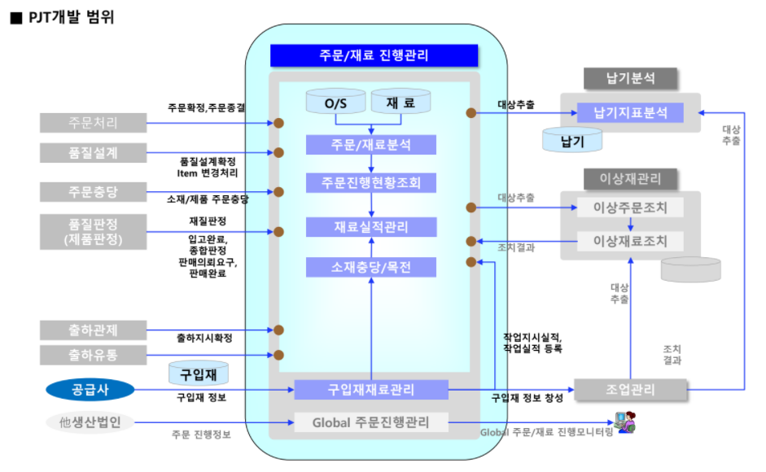
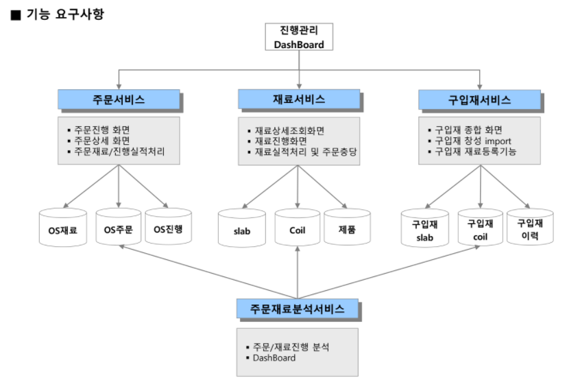

# 03.07 (월) 회의록

    작성자 : [Eddy]지혜

> 회의 주제

- 전반적인 프로젝트 구성이해

> 결정 사항

1. 회의록 작성

   a. 팀원 번갈아가며 작성  
   b. 당일 회의록 작성자 커밋 규칙과 함께 document repo에 commit 할 것.

2. 프로젝트 구성
|PJT 개발범위   |구성도|
|---|---|
|||

+ o/s : 주문(order), 주문번호, 납기, 회사명 등
+ 재료 실적 : 제철소에서 정보가 오는데 테스트 화면을 만들어서 공정 순서대로 버튼을 누르면 하나씩 API가 날라가면서 없던 재료가 생기고 추가되는 등의 데이터 변동
+ 소재충당/목전(목적전환) 
   + 예) 스타벅스에 보낼 커피 원두를 만들던 중 질이 좋지 않을 경우 버리기 아까우니까 조금 더 저렴한 브랜드를 찾아서 저렴한 브랜드에 대신 보내는 것을 목전(목전전환)이라고 한다.
+ 구입재 : 구입해오는 소재
   + 외부에서 어느정도 만들어진 slab, coil 같은 것을 작은 철강회사에서 구매해오는 느낌(이미 만들어진 제품을 사오는 것)
   -> 그러면 DB에 insert되기 때문에 없던 데이터가 생긴다.
### 💡 추가 기능 후보
   1. 현재 엑셀에 import하는 것이 번거롭고 불편하기 때문에 엑셀에서 바로 복사해서 붙여넣을 수 있는 기능이 있으면 편리할 것 같다.

> Next meeting

- 다음 회의록 작성자 : [BBororo] 계환

- **_주제 : 기술 스택 리스트 결정하기_**